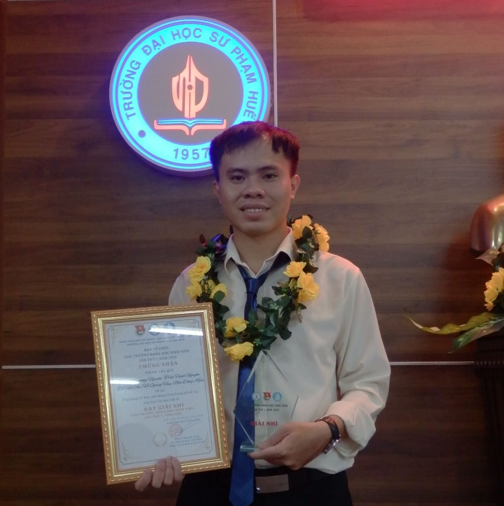

# BÀI TẬP VỀ NHÀ - Tuần 1
## Giới thiệu bản thân
---

### Họ và tên:
**Mai Đăng Khoa**

---

### 🖼️ Ảnh đại diện:

---

### 💬 Giới thiệu bản thân:
Xin chào! Mình là **Mai Đăng Khoa**, hiện đang là sinh viên lớp Tin 2B.  
Mình mong muốn trở thành một giáo viên Tin Học trong tương lai.  

---

### 🎯 Danh sách sở thích:
- 💻 Tin học và lập trình
- 📚 Đọc sách
- 🎵 Nghe nhạc
- ⚽ Chơi thể thao
- ✈️ Du lịch

---

### 📞 Thông tin liên hệ:
- **Email:** khoamai2912@gmail.com  
- **Số điện thoại:** 085 962 9889  
- **Facebook:** [Mai Đăng Khoa](https://www.facebook.com/khoamai0402/)